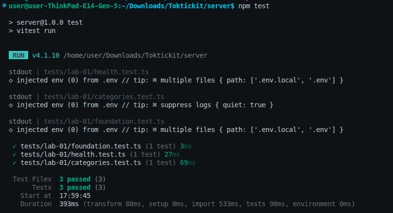
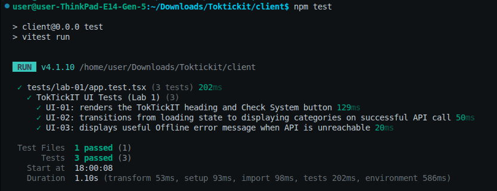

# Lab 1 Automated Tests

All test files are located under `server/tests/lab-01/` (server) and `client/tests/lab-01/` (client).

## Test Summary

| Test ID | Test File | Tool | Test Description | Status |
|---------|-----------|------|------------------|--------|
| API-01 | `server/tests/lab-01/health.test.ts` | Supertest | Health endpoint returns 200 and expected JSON | ✅ Pass |
| API-02 | `server/tests/lab-01/categories.test.ts` | Supertest | Categories endpoint returns the four seeded categories | ✅ Pass |
| UI-01 | `client/tests/lab-01/app.test.tsx` | Vitest | TokTickIT heading renders correctly | ✅ Pass |
| UI-02 | `client/tests/lab-01/app.test.tsx` | Vitest | Loading state transitions to category list display | ✅ Pass |
| UI-03 | `client/tests/lab-01/app.test.tsx` | Vitest | API failure displays a useful error message | ✅ Pass |

---

## API Tests (Server — Supertest)

### API-01: Health endpoint returns 200 and expected JSON

- **File:** `server/tests/lab-01/health.test.ts`
- **Tool:** Supertest + Vitest
- **Description:** Sends a `GET /api/health` request and verifies:
  - HTTP status code is `200`
  - Response body equals `{ "status": "ok", "service": "TokTickIT API" }`

### API-02: Categories endpoint returns the four seeded categories

- **File:** `server/tests/lab-01/categories.test.ts`
- **Tool:** Supertest + Vitest
- **Description:** Sends a `GET /api/categories` request and verifies:
  - HTTP status code is `200`
  - Response body is an array with length `4`
  - The category names are exactly `["Account and Access", "Hardware", "Software", "Network"]` in ascending ID order

---

## UI Tests (Client — Vitest)

### UI-01: TokTickIT heading renders correctly

- **File:** `client/tests/lab-01/app.test.tsx`
- **Tool:** Vitest + React Testing Library
- **Description:** Renders the `<App />` component and verifies that the `<h1>` heading `"TokTickIT"` and the `[Check System]` button are present on initial render.

### UI-02: Loading state transitions to category list display

- **File:** `client/tests/lab-01/app.test.tsx`
- **Tool:** Vitest + React Testing Library
- **Description:** Mocks `fetch` for both `/api/health` and `/api/categories`. Clicks the `[Check System]` button and verifies:
  - `System Status: Online` status is displayed
  - Category list appears with 4 items: `"Account and Access"`, `"Hardware"`, `"Software"`, and `"Network"`

### UI-03: API failure displays a useful error message

- **File:** `client/tests/lab-01/app.test.tsx`
- **Tool:** Vitest + React Testing Library
- **Description:** Mocks `fetch` to reject with a network error. Clicks the `[Check System]` button and verifies that `System Status: Offline` is displayed with a useful error message.

---

## Test Results Screenshot

